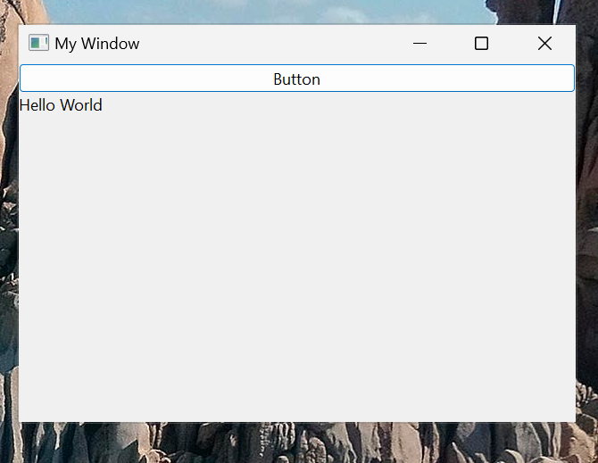
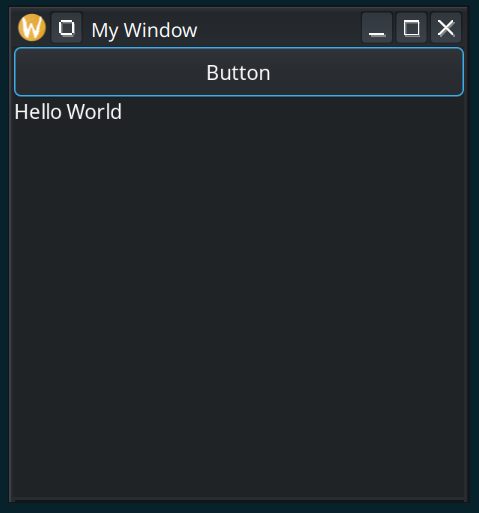
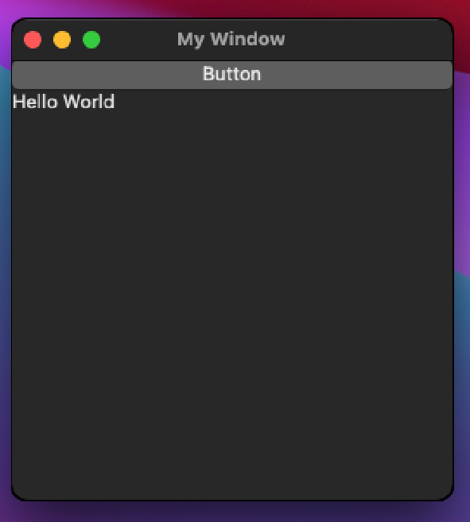

# Rim
*Retained &larr; Immediate Mode*

Rim is an UI library that translates immediate-mode UI calls into a retained-mode UI tree.
It's able to do this using a [virtual DOM](https://en.wikipedia.org/wiki/Virtual_DOM) that diffs UI trees and applies
changes to a window using a native toolkit (such as GTK, Cocoa, etc)

It's very similar to react.js, but provides a imgui-like API rather than something like JSX.

## Example
```
#include <stdio.h>
#include <rim.h>
int mymain(struct RimContext *ctx, void *arg) {
    int show_more = 0;
    while (rim_poll(ctx)) {
        if (im_begin_window("My Window", 500, 500)) {
            if (im_button("Button")) show_more = !show_more;
            if (show_more) im_label("Hello World");
            im_end_window();
        }
    }
    return 0;
}
int main(void) {
    return rim_start(mymain, NULL);
}
```


## Modular backend

- Rim is capable of supporting multiple different UI toolkits (backends).
- currently [LibUI](https://github.com/libui-ng/libui-ng) is the only backend, but adding a Qt or wxWidgets backend would be trivial.
- LibUI backend Supports Win32 (Windows Common Controls), MacOS (Cocoa), and Linux (GTK3)

## Fast?

The tree builder and differ is fast enough that there should be virtually zero overhead for basic changes. (eg: text in a label changes)
For more info see [perf](docs/perf.md).

## Compiling
Rim is compiled as a static library with the backend included.
On Linux, `libgtk-3-dev` is required.
```
git clone https://github.com/petabyt/libui-dev.git --depth 1 --recurse-submodules
git clone https://github.com/petabyt/rim.git --depth 1 --recurse-submodules
cd rim
cmake -G Ninja -B build -DRIM_COMPILE_DEMOS=ON CMAKE_BUILD_TYPE=Debug
cmake --build build
```

## Roadmap
- [ ] Support tables
- [ ] Widget Recycler
- [ ] Support multiple sessions in one process
- [ ] A way to handle RecyclerViews/tables
- [ ] Qt backend
- [ ] Jetpack Compose backend

# Why?

See [why](docs/why.md).
